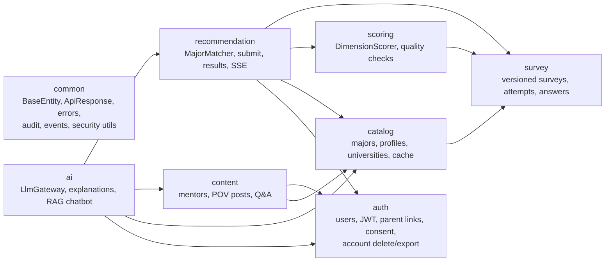
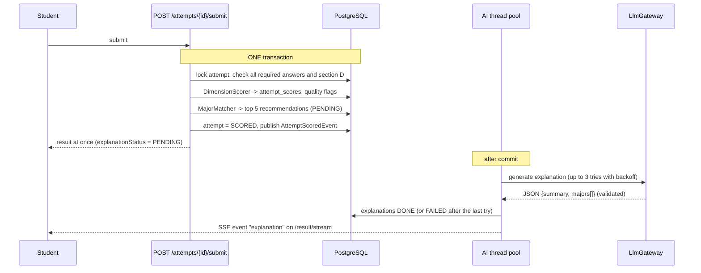

# Career guidance backend

Backend of a website that helps Vietnamese students in grades 11-12 choose a university major.

**Flow:** survey → deterministic scoring of the student's dimensions → top 5 majors with an AI-written explanation →
read first-person posts (POV) from people working in the field → compare majors, see universities and cutoff scores.

The ranking is plain Java. The LLM only **writes text**: it explains a result that was already computed, and it answers
chatbot questions from data the platform already holds. It never decides which major fits.

- Java 17, Spring Boot 3.5, Maven
- PostgreSQL 16 with pgvector, Redis
- Flyway migrations (`ddl-auto=validate`), Spring Security with JWT, Spring AI, Spring Modulith
- Swagger UI at `/swagger-ui.html`

## Contents

1. [Quick start](#quick-start)
2. [Architecture](#architecture)
3. [Main flows](#main-flows)
4. [Configuration](#configuration)
5. [API overview](#api-overview)
6. [Security and personal data](#security-and-personal-data)
7. [Using a real LLM](#using-a-real-llm)
8. [Sample data](#sample-data)
9. [Tests](#tests)
10. [Deployment](#deployment)

## Quick start

You need JDK 17, Maven and Docker.

```bash
docker compose up -d --wait       # PostgreSQL (pgvector) on :5432 and Redis on :6379
mvn spring-boot:run               # profile "dev"; migrations run automatically
```

Open http://localhost:8080/swagger-ui.html.

- An admin account is created in dev: `admin@career.local` / `Admin12345`.
- The chatbot search index is built at startup in dev (`app.ai.rag.index-on-startup`).
- No API key is needed: without one the app uses a built-in fake LLM (see [Using a real LLM](#using-a-real-llm)).

Everything in a container, including the app itself:

```bash
docker compose --profile app up -d --build     # app on http://localhost:8080
```

### Trying the whole flow in Swagger

1. `POST /auth/register` a STUDENT (`dateOfBirth` is required), then `POST /auth/login` and press **Authorize** with the access token.
2. `GET /surveys/active`, then `POST /attempts`.
3. `PUT /attempts/{id}/answers` (LIKERT answers are 1 to 5, MINI_TEST answers are option ids) and `PUT /attempts/{id}/constraints`.
4. `POST /attempts/{id}/submit` returns the top 5 majors at once. `GET /attempts/{id}/result` (or `/result/stream`) shows the explanations when they are ready.
5. `GET /majors`, `GET /majors/{id}`, `GET /majors/compare?ids=a,b,c` need no login.
6. `POST /chat` asks the chatbot; it lists its sources.
7. `GET /me/export` downloads all your data, `DELETE /me` erases it.

## Architecture

A **modular monolith**: one deployable, strict module boundaries checked by a test
(`ModularityTest` runs Spring Modulith's `ApplicationModules.verify()`).



Every module depends on `common`. Rules that are enforced:

- A module never touches another module's entities or repositories. It calls an interface in the other module's
  `application` package (for example `SurveyAttemptApi`, `CatalogQueryApi`, `AccountAccessApi`) and gets plain records back.
- Inside a module: `api/` (controllers and DTO records), `application/` (use cases), `domain/` (entities and pure logic),
  `infrastructure/` (repositories, mappers, external clients).
- Modules react to each other through events (`AttemptScoredEvent`, `PovPublishedEvent`, `MajorChangedEvent`, ...)
  published via `DomainEventPublisher`. Today that is Spring's in-process bus; only that interface would change to move to RabbitMQ.
- Data erasure and export use two small interfaces in `common` (`UserDataEraser`, `UserDataExporter`) that every module
  implements for its own tables, so `auth` does not have to know about them.

Algorithms that are unit tested without Spring: `DimensionScorer`, `QualityChecker`, `MajorMatcher`, `AnswerValidator`,
`TextChunker`, `CrisisDetector`.

### Database

Schema is owned by Flyway (`src/main/resources/db/migration`); Hibernate only validates it.

| Migration | Content |
|---|---|
| `V1`, `V1_1` | users, refresh tokens, parent links, consents, audit log |
| `V2`, `V2_1` | survey schema, seed: 19 dimensions and survey v1 (70 questions) |
| `V3`, `V3_1`, `V3_2` | catalog schema, seed: 30 majors with profiles, 8 sample universities and admission data |
| `V4` | recommendations and summaries |
| `V5`, `V5_1` | mentors, POV posts, Q&A, seed: 5 sample mentors and posts |
| `V6` | pgvector extension, `content_chunks` (HNSW index), `chat_messages` |

## Main flows

### Submit and explanation



If the LLM fails, recommendations are still valid: they just have `explanationStatus = FAILED` and no text.

### Scoring and matching

- **Dimension score:** each answered question contributes `value x weight` (Likert 1-5, reversed as `6 - v` when
  reverse scored; mini-tests 1 or 0). `normalized = (raw - min) / (max - min)`, always within [0, 1].
- **Quality flags** (stored on the attempt): `ATTENTION_FAILED` (2 or more wrong attention checks), `STRAIGHT_LINING`
  (at least 90% identical Likert answers), `TOO_FAST` (under 3 seconds per question). The first two set `lowReliability`.
- **Matching (`algo_version = v1`):** `base = 0.5 x cos(interest) + 0.25 x cos(aptitude) + 0.25 x cos(values)`.
  Hard filter: inactive majors and majors sharing no exam combination with the student's. Soft penalties (-0.10 each,
  listed in the breakdown): every university in the chosen regions is above the budget; the expected exam total is
  more than 3 points below the lowest recent cutoff.

### Roles

| Role | Can |
|---|---|
| `STUDENT` | take the survey, read own results, use the chatbot and Q&A (once any required parental consent is given) |
| `PARENT` | link to children with an invite code, read approved children's results (audited); can apply to become a mentor |
| `MENTOR` | write POV posts once verified by an admin |
| `ADMIN` | manage surveys, catalog and content, review posts, verify mentors, rebuild the search index |

Students under 16 (`app.consent.min-age`) start as `PENDING_PARENT_CONSENT`: they can take the survey but not use the
chatbot or Q&A until a parent has redeemed their invite code and given consent.

## Configuration

Secrets come from environment variables (see `.env.example`). Profiles: `dev` (default), `test`, `prod`.

| Variable | Default | Meaning |
|---|---|---|
| `SPRING_PROFILES_ACTIVE` | `dev` | `dev`, `prod` (or `test` in tests) |
| `DB_URL`, `DB_USERNAME`, `DB_PASSWORD` | dev defaults | PostgreSQL. Required in prod |
| `REDIS_HOST`, `REDIS_PORT` | `localhost`, `6379` | Redis: catalog cache, login limiter, chat rate limit. Host required in prod |
| `JWT_SECRET` | dev default | At least 32 characters. Required in prod |
| `CORS_ALLOWED_ORIGINS` | `http://localhost:5173` | Comma separated frontend origins |
| `BOOTSTRAP_ADMIN_EMAIL`, `BOOTSTRAP_ADMIN_PASSWORD` | dev: `admin@career.local` / `Admin12345` | First admin, created at startup if missing |
| `AI_ENABLED` | `false` | `true` uses a real model, `false` the fake one |
| `AI_PROVIDER` | `none` | Spring AI provider (`openai`) when `AI_ENABLED=true` |
| `OPENAI_API_KEY`, `OPENAI_CHAT_MODEL`, `OPENAI_EMBEDDING_MODEL` | | Provider settings |
| `APP_PORT` | `8080` | Port of the app container in docker compose |

Tunable application settings live under `app.*` in `application.yml`: token lifetimes, consent age, login limit
(5 failures per 15 minutes), matching weights (must add up to 1) and penalties, quality thresholds, catalog cache TTL (1 hour),
explanation retries, chat rate limit (20 messages per hour) and history (10 messages), chunk size (500 tokens, 50 overlap).

## API overview

Base path `/api/v1`. Every response uses `{ "success", "data", "error", "timestamp" }`; errors carry a stable
`error.code`. Lists use `page` (from 0) and `size` (max 100) and return `{ items, page, size, totalItems, totalPages }`.
Every response has an `X-Trace-Id` header (also in the logs).

| Area | Endpoints |
|---|---|
| Auth | `POST /auth/register`, `/auth/login`, `/auth/refresh` (rotates), `/auth/logout`; `GET /me`; `GET /me/export`; `DELETE /me` |
| Parents | `POST /parent/invites` (student), `POST /parent/links`, `GET /parent/students`, `GET /parent/students/{id}/results` (parent) |
| Survey | `GET /surveys/active`; `POST /attempts`; `GET /attempts/{id}/survey` (the questions of that attempt's version); `PUT /attempts/{id}/answers`, `/constraints`; `GET /attempts/{id}`; `GET /me/attempts` |
| Results | `POST /attempts/{id}/submit`; `GET /attempts/{id}/result`; `GET /attempts/{id}/result/stream` (SSE) |
| Catalog (public) | `GET /majors`, `/majors/{id}`, `/majors/compare?ids=`, `/universities?region=` |
| Content | `GET /majors/{id}/povs`, `/povs/{id}` (public); `POST /mentor/apply`; `POST/PUT /povs`, `POST /povs/{id}/submit`; `GET/POST /majors/{id}/qa`, `/qa/{id}/answers` |
| Chatbot | `POST /chat` |
| Admin | `/admin/surveys`, `/admin/sections`, `/admin/questions`, `/admin/dimensions`; `/admin/majors`, `/admin/universities`, `/admin/university-majors`; `/admin/povs`, `/admin/mentors`, `/admin/qa`; `POST /admin/embeddings/rebuild` |
| Ops | `GET /actuator/health` (with `/liveness` and `/readiness`) |

Full request and response schemas are in Swagger UI.

## Security and personal data

- Passwords: BCrypt strength 12. Access token 15 minutes, refresh token 7 days, stored hashed, rotated on use,
  reuse of an old refresh token revokes the whole session. Login: 5 failures per 15 minutes per email lock it temporarily (429).
- 401 for a missing or bad token, 403 for the wrong role or someone else's data. Students only see their own attempts;
  parents only the results of children with an APPROVED link; students never receive correct answers or scoring metadata.
- Audit log (`audit_logs`): parents or admins viewing a student's result, parent link approvals, POV reviews, mentor
  verification, role changes, survey publishing, Q&A moderation, data export, account deletion, index rebuilds.
- Logs never contain scores, answers, family information, chat text or full emails; each request has a `traceId`.
- Q&A shows authors by role ("Học sinh", "Phụ huynh", a mentor's job title), never real names.
- `GET /me/export` returns everything stored about the caller as JSON. `DELETE /me` erases survey answers, scores,
  constraints, recommendations, chat history, posts and Q&A, then anonymises the account (no name, birth date or real email,
  can never log in). The audit entry keeps ids only. Admin accounts cannot be deleted through the API.
  Access tokens already issued stop working at once for `/me` and the account endpoints; other endpoints accept them
  until they expire (at most 15 minutes) because tokens are not checked against the database on every request.
- The chatbot recognises messages that suggest distress and answers with a fixed, caring message that points to
  trusted adults, professionals and the national helplines, without calling the model.

## Using a real LLM

By default the app runs with `FakeLlmGateway`: fixed template text and a hashing based "embedding" so that everything
works offline (tests use it too). To use a real model:

```bash
export AI_ENABLED=true
export AI_PROVIDER=openai
export OPENAI_API_KEY=sk-...
```

then restart and call `POST /admin/embeddings/rebuild` once so the chunks are re-embedded with the real model.
`vector(1536)` in `V6__rag_chat.sql` and `app.ai.embedding-dimensions` must match the embedding model (1536 fits
`text-embedding-3-small`); a model with another size needs a new migration.

`LlmGateway` is the only place that talks to a model, so another provider means one new implementation.
The real gateway (`SpringAiLlmGateway`) has been compiled and wired but **not run against a live provider** in this
repository's tests, which use the fake gateway. Try it with a low quota first.

## Sample data

Development seed data is **invented** and flagged so it can never pass as real:

- Universities are fictional ("Đại học Mẫu ..."), cutoff scores and tuition are generated by a formula.
  `sampleData: true` is returned by the API for them.
- Mentors and their POV posts are fictional; the mentor accounts are locked and cannot log in. Posts return `sampleData: true`.
- Major profile weights and survey question wording are starting values based on Holland's RIASEC theory and must be
  reviewed by a career guidance expert before real students rely on them.

Replace sample data with real, sourced data through the admin API before going live.

## Tests

```bash
mvn test        # needs a running Docker daemon: integration tests start PostgreSQL (pgvector) and Redis with Testcontainers
```

- Pure unit tests for the algorithms and validators.
- Integration tests through the real HTTP layer against real PostgreSQL and Redis: auth and security (401, 403, 429),
  survey, scoring and submit, catalog and cache, content workflow, explanations and SSE, chatbot and pgvector search,
  account export and deletion, health.
- `ModularityTest` fails the build when a module reaches into another module.

## Deployment

The `Dockerfile` is multi-stage (Maven build, then a small JRE image running as a non-root user) with a healthcheck on
`/actuator/health`, which also checks PostgreSQL and Redis. In production:

- run with `SPRING_PROFILES_ACTIVE=prod` (the image default) and provide `DB_*`, `REDIS_HOST`, `JWT_SECRET` and `CORS_ALLOWED_ORIGINS`;
- Swagger UI is disabled in `prod`;
- the database needs the pgvector extension (`CREATE EXTENSION vector`), the `pgvector/pgvector:pg16` image includes it;
  on a managed database enable the extension before the first start;
- put the app behind a TLS terminating proxy (`server.forward-headers-strategy=framework` is set in `prod` so the real client IP is used).

Known limits: the chatbot's distress detection is keyword based and conservative, so it can miss unusual wording; the
fake gateway's off-topic detection is a simple keyword list (a real model uses the system prompt instead);
`POST /admin/embeddings/rebuild` runs synchronously.

### Deploy to Render

The repo's `Dockerfile` works as-is for a Render **Web Service** (type: Docker). `server.port` reads `${PORT:8080}`,
so it follows whatever port Render assigns.

1. New Web Service → connect this repo → Environment: **Docker** (Render finds the `Dockerfile` automatically).
2. Add a managed Postgres with the **pgvector** extension (e.g. [Neon](https://neon.tech)) and a Redis instance
   (Render's own Key Value service, or Upstash) — Render's free Postgres does not include pgvector.
3. Set these environment variables on the service (values from your provider's dashboard, never commit them):

   | Variable | Notes |
   |---|---|
   | `DB_URL` | `jdbc:postgresql://<host>/<db>?sslmode=require` — **do not add `channelBinding=require`**: pgjdbc's channel-binding negotiation fails through Neon's pooled (`-pooler`) endpoint with a generic `password authentication failed` |
   | `DB_USERNAME`, `DB_PASSWORD` | from the provider |
   | `REDIS_HOST`, `REDIS_PORT` | from the Redis provider |
   | `JWT_SECRET` | random string, 32+ chars |
   | `CORS_ALLOWED_ORIGINS` | the deployed frontend's origin |
   | `AI_ENABLED`, `AI_PROVIDER`, `OPENAI_API_KEY` | set for a real model, see [Using a real LLM](#using-a-real-llm) |

   `SPRING_PROFILES_ACTIVE=prod` and `PORT` are already set by the Dockerfile/Render; no need to add them.
4. First deploy runs Flyway automatically (creates the schema, enables `vector`, seeds sample data). Once it's up,
   call `POST /admin/embeddings/rebuild` (logged in as admin) so the chatbot's index uses the real embedding model.
